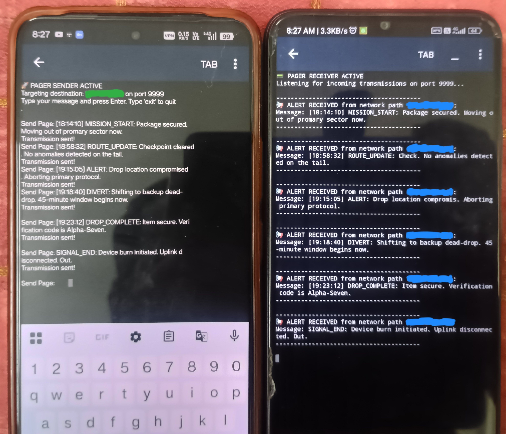

# 📟 UDP Mesh Pager

A lightweight, zero-memory digital pager system built in Python that allows two Android devices to communicate globally across firewalls using a Mesh VPN.

## 🚀 How It Works
Instead of using a centralized database or permanent chat logs, this system uses fire-and-forget **UDP packets** (`socket.SOCK_DGRAM`). 
By establishing a Mesh VPN connection (like Tailscale) between devices, the scripts bypass Carrier-Grade NAT (CGNAT) restrictions on mobile data networks, creating a completely secure, direct virtual communication bridge.

## 🛠️ Prerequisites & Setup

1. **Install Python on Android:** Download **Pydroid 3** from the Google Play Store or **Termux** from F-Droid on both Android devices.
2. **Setup the VPN:** 
   * Install a mesh network provider (e.g., Tailscale) on both phones.
   * Connect both devices to the same virtual network account.
   * Note down the **Virtual IP address** of the receiving phone.

## 📦 Running the Application

### 1. Start the Receiver (The Pager)
Run `pager_receiver.py` on the destination phone first. This script will bind to `0.0.0.0`, meaning it will actively listen for incoming packets on port `9999` across all network interfaces (Wi-Fi, Mobile Data, and VPN).

```bash
python pager_receiver.py

```

### 2. Run the Sender (The Dispatcher)

Open `pager_sender.py` on the transmitting phone. **Before running**, update the `BROTHER_VPN_IP` variable with the exact virtual IP address of the receiver phone.

```bash
python pager_sender.py

```

Type your alert message, press Enter, and the text payload will transmit instantly across the encrypted tunnel!

## 🎯 Primary Use Case: Tactical "Spy Pager" Sandbox

This repository serves as a software blueprint for a stealthy, hardware-independent tactical pager grid. Imagine two field agents who need to pass real-time code words globally without leaving a trace on their physical devices or exposed over the open web.

### ⚡ Tactical Advantages (Why this Architecture Wins)
* **Zero Forensic Footprint:** By using stateless UDP (`socket.SOCK_DGRAM`) with zero persistent local log caching or database exports, messages exist purely in the device's volatile memory (RAM). The exact microsecond the script is terminated, all communication history vanishes completely, leaving absolutely nothing for an adversary to recover during a physical device inspection.
* **The Invisible Bridge:** Encapsulating the raw UDP packet sequence entirely inside a Mesh VPN wrapper ensures that all text payloads are completely encrypted before they hit the open wire. To an outside hacker or a hostile internet service provider monitoring the local cell tower, the data looks like unreadable network noise.

### ⚠️ Operational Vulnerabilities (The Reality Check)
* **Metadata Leakage (Traffic Analysis):** While the VPN successfully hides *what* you are saying, it cannot hide *that* you are speaking. An adversary monitoring network infrastructure can observe the constant, regular timing signatures of your heartbeat packets. A sharp increase in UDP packet traffic perfectly synchronized with an operational event will compromise the sender's identity through timing correlation.
* **Centralized Trust Failure:** The system relies on a third-party commercial coordination server to stitch the mesh network together across mobile SIM firewalls (CGNAT). If the VPN provider's central handshake architecture is blocked, subpoenaed, or compromised by an adversary, the entire operational communication network collapses instantly.

## Demo
<p align="center">
  
  <br>
  <i>Figure 1: Side-by-side execution of the UDP Sender and Receiver scripts running over an encrypted mesh VPN tunnel.</i>
</p>
